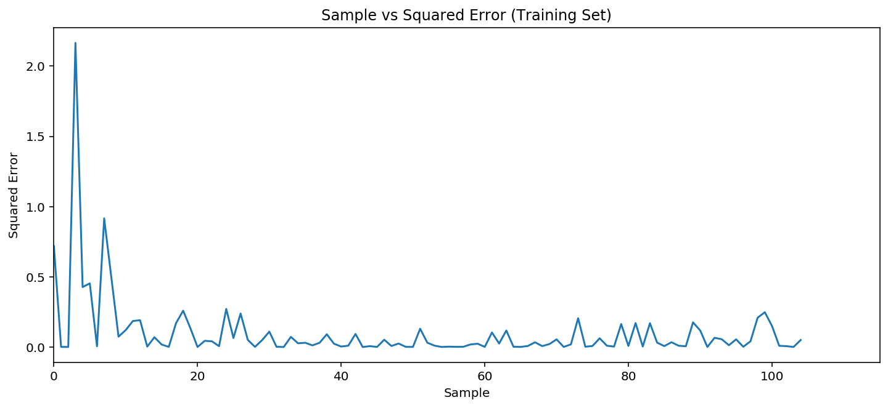
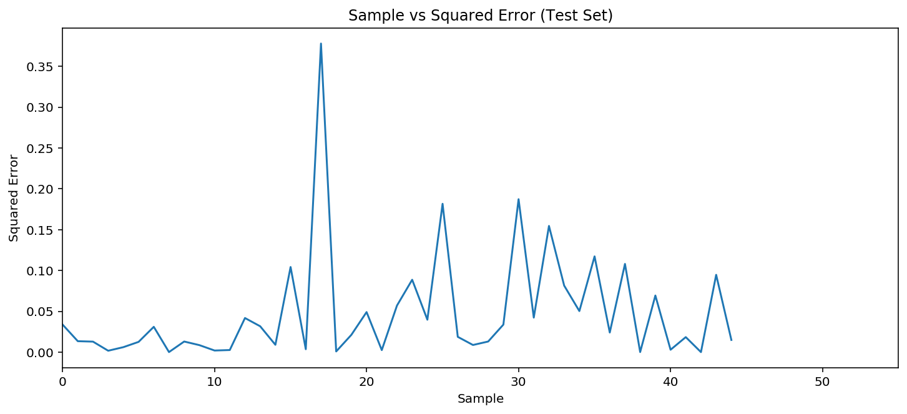

# Foreword

#### Why  I'm Ryan, an aspiring 🏀 sports ⚽ analyst/enthusiast, self-proclaimed meme specialist, and avid durian connoisseur. This will be my first post of many, and today I would like to discuss the Passive Aggressive Regression method.

# **INTRODUCTION**

The `Passive-Aggressive Regression` technique was famously introduced by [Crammer, Dekel et.al in 2006](http://jmlr.csail.mit.edu/papers/volume7/crammer06a/crammer06a.pdf). It is a variation of the Logistic Regression where it's used to produce efficient step-wise algorithms.

Without diving too much into the technical and/or mathematical details, we're basically going to introduce an additional factor to the hinge loss function ($L$) as shown below: the "$\epsilon$-insensitive" loss. Its role is to allow for control of tolerance of prediction errors while fitting a model for continuous data.

$$ L = \begin{cases} 0 \ \ \ if \ \ \ |y_i - \hat y_i|-\epsilon \leq 0\\ |y_i - \hat y_i|-\epsilon \ \ \ \ \ \ otherwise \end{cases}$$

What the hinge loss function above is saying is basically one or the other would happen depending on what $|y_i - \hat y_i|-\epsilon$ evaluates to.

In the following example, assuming $|y_i - \hat y_i|-\epsilon$ evaluated to a positive integer:

$$|y_i - \hat y_i|-\epsilon > 0$$
$$ \therefore L = |y_i - \hat y_i|-\epsilon$$

The hinge loss function $L$ will take what $|y_i - \hat y_i|-\epsilon$ evaluated to and force an adjustment. It is in essence the `"aggressive"` side of the regressor.

However if $|y_i - \hat y_i|-\epsilon$ evaluated to a value that was zero or lower, then:

$$|y_i - \hat y_i|-\epsilon \leq 0$$
$$ \therefore L = 0$$

The loss function is forced to be zero, thereby providing the `"passive"` part of the regressor.

To summarize, the $\epsilon$ value allows us to control how aggressive we want the loss hinge function to affect our model.

# Processing The Data

For this exercise we'll utilize the **Iris** dataset available in the scikit-learn package. We'll perform a `Multinomial Logistic Regression` (more than 2 classes) and compare its results with that derived from the `Passive-Aggressive Regression`.


```python
# These will be our imports for this example.

from matplotlib import pyplot as plt

import numpy as np
import pandas as pd
from scipy import stats

from sklearn.linear_model import LogisticRegression, PassiveAggressiveRegressor
from sklearn.model_selection import train_test_split
from sklearn.preprocessing import StandardScaler

from sklearn.datasets import load_iris

%config InlineBackend.figure_format = 'retina'
%matplotlib inline
```

The **Iris** dataset contains 150 rows of data and 4 feature columns, with only 3 unique, non-negimgative outcomes (*Classes*) when it comes to the dependent variable.


```python
iris = load_iris()

X = iris.data
y = iris.target
```


```python
print("Unique class labels:", np.unique(y))
print(list(iris.target_names))
```

    Unique class labels: [0 1 2]
    ['setosa', 'versicolor', 'virginica']


The class labels above, ```0, 1, 2``` have already been respectively assigned in place of each class of **Iris** flower: ```Iris-setosa```", "```Iris-versicolor```" and "```Iris-virginica```".

Now that we have the independent and dependent datasets defined, let's perform a ```30%``` test split with scikit-learn's ```train_test_split``` function. We'll also fix the `random_state` seed at ``1990`` to ensure our results are reproducible.


```python
X_train, X_test, y_train, y_test = train_test_split(X, y, test_size=.3, random_state=1990, shuffle=True)
```

Note that we always want to perform a `train_test_split` before doing anything else with our data.

Since we're interested in a `Multinomial Logistic Regression` for this exercise to compare with the results from a `Passive-Aggressive Regression`, we have to be cognizant of the fact that it only works for models with classified unique outcomes.

*Note: `Multinomial Logistic Regression` will be hereafter known as `"MLR"`. `Passive-Aggressive Regression` is hereafter known as `"PAR"`.*

Recall that the flowers have already been classified into `0`, `1` and `2` respectively! We can perform a `MLR` on this model and see how it performs compared to a `PAR`.

Since we've already split our data, we're now ready to standardize our independent variables with the `StandardScaler` function found in scikit-learn's preprocessing package.


```python
ss = StandardScaler() # We initiate a new instance of the StandardScaler class and assigned it to the variable "ss"

ss.fit(X_train)
# Using the fit method above, we obtain the sample mean and sample std.dev (scaling parameters) for each feature column from the training dataset.
# The scaling parameters are stored specifically to the "ss" variable for the next step.

Z_train = ss.transform(X_train)
Z_test = ss.transform(X_test)
# This step uses each of the feature's mean and std.dev and performs standardization to them.
# We're using the same scaling parameters to transform the test dataset so that they are comparable to each other.
# We're assigning each of the standardized features to new variables.
```

# **The Multinomial Logistic Regression**


```python
lrg = LogisticRegression(multi_class="multinomial", solver="newton-cg")
lrg.fit(X_train, y_train)
print(f"The train set score is {lrg.score(X_train, y_train)}.")
print(f"The test set score is {lrg.score(X_test, y_test)}.")
```

    The train set score is 0.9714285714285714.
    The test set score is 0.9777777777777777.


### **Note: I would include several Decision Surface plots via the Tom Dupre La Tour method in a future update.**

As we've discovered preliminarily, the `MLR` performed extremely well on the Iris dataset. Let's examine how the `PAR` performs.

# **The Passive-Aggressive Regression**


```python
par = PassiveAggressiveRegressor(C=0.05, loss="squared_epsilon_insensitive", epsilon=0.001, max_iter=2000, random_state=1000)

def par_train(Ztrain, ytrain):
    squared_errors = []
    for (x,y) in zip(Ztrain,ytrain):
        par.partial_fit(x.reshape(1, -1), y.ravel())
        y_pred = par.predict(x.reshape(1, -1))
        squared_errors.append(np.power(y_pred - y, 2))
    sample = [i for i in range(0,len(ytrain))]
    print(f"The train set score is {par.score(Ztrain, ytrain)}.")
    plt.figure(figsize=(12,5))
    plt.plot(sample, squared_errors)
    plt.title("Sample vs Squared Error (Training Set)")
    plt.xlim(0, len(y_train)+10)
    plt.ylabel("Squared Error")
    plt.xlabel("Sample");
```


```python
par_train(Z_train, y_train)
```

    The train set score is 0.9056110143648486.





```python
def par_test(Ztest, ytest):
    squared_errors = []
    for (x,y) in zip(Ztest,ytest):
        y_pred = par.predict(x.reshape(1, -1))
        squared_errors.append(np.power(y_pred - y, 2))
    sample = [i for i in range(0,len(ytest))]
    print(f"The test set score is {par.score(Ztest, ytest)}.")
    plt.figure(figsize=(12,5))
    plt.plot(sample, squared_errors)
    plt.title("Sample vs Squared Error (Test Set)")
    plt.xlim(0, len(ytest)+10)
    plt.ylabel("Squared Error")
    plt.xlabel("Sample");
```


```python
par_test(Z_test, y_test)
```

    The test set score is 0.9041007116772458.





As we can see from the plots above, the model continuously attempted to bring the Loss function value ever closer to zero as more sample data was passed through it. Every new data point alters the existing trend, resulting in an oscillating behaviour.

Whenever the model takes a sample whose result it fails to predict correctly, it gets penalized which results in the various spikes you see in these plots. The subsequent samples will force the model to readapt its parameters, but it's results will still reflect the effects of the previous samples.

Therefore passive-aggressive algorithms tend to be conservative to previous knowledge. Once the model learns some form of dependency, its almost unable to forget it completely. This behaviour can be witnessed in the test plot, where it struggles to settle down at the latter samples, albeit with fewer samples than the training set.

# Conclusion

While the `PAR` didn't fare as well as the `MLR`, the fact that the `MLR` overperformed with scores of `97%` on both its train and test set predictions should warrant further examination to rule out overfitting.

If a critical decision had to be made on the spot, I would err on the side of caution and select the model predicted by the `PAR`.
