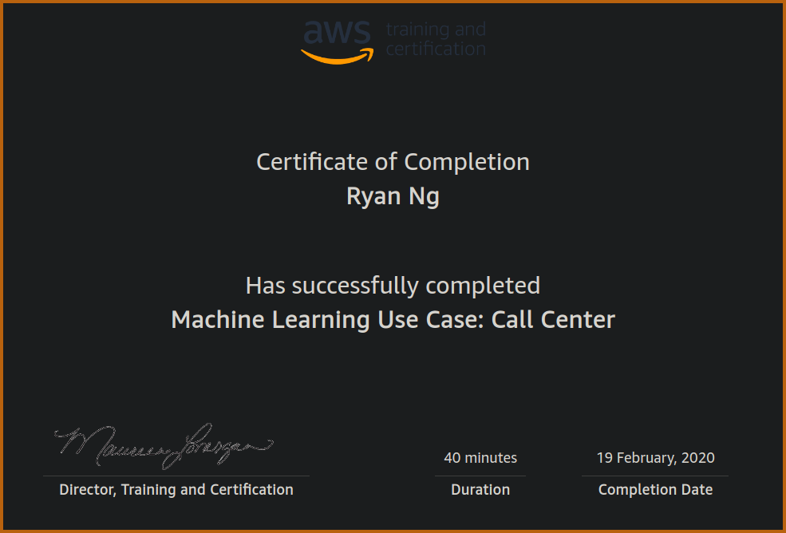

# Takeaways from Amazon's Machine Learning Use Case: Call Center

> Home of Big Data - Amazon

I recently completed Amazon's short machine learning *Use Case* that was centered on improving the efficiency and accuracy of their call center routing system.

Here are a few takeways I took note of from the course.

## 1.0 Problem Framing

Before embarking on implementing a machine learning solution for your business, you should first frame the problem within the context of your business. A simple guide would be to obey the following steps:

1. Understand context
2. Identify baseline
3. Convert business problem -> ML problem

When it comes to *understanding context*, you should be prepared to consult with domain experts if necessary. Be sure to ask them wide ranging questions so that you could properly frame the business problem and account for edge cases within a reasonable and solvable context.

Meanwhile it is also important to identify a baseline as it allows *Opportunity Analysis* to be performed. With a baseline, performance can be compared.

If there's no production level decision making system in place, use an educated guess.

Once these measures have been taken, you would be better prepared to convert your business problem into a machine learning one. At this stage it is crucial to think critcally about how a correct prediction could change your business metric.

## 2.0 Data Handling

After the previous stage is completed, you should start looking at your data and ascertain whether you have what you need to attempt a machine learning solution. This is the most important stage of the entire process, and is where most of the mistakes can occur.

Of course its not that simple; you also have to look at other aspects of your data and see if you can simplify it where logically appropriate. A good rule of thumb to follow is to check if there are labels in minor quantities that are similar enough to be combined; the fewer labels the better.

#### 2.1 Train/Development/Test

Compared to what I've learnt which is a regular train-test split, Amazon suggests a three part split of your data when developing the machine learning model. Doing this can better help with overfitting.

Amazon has suggested a 70-15-15 split if you have a lot of data available. Otherwise do a 80-10-10 split.

## 3.0 Modeling

Amazon prioritizes the **Precision-Recall Tradeoff** in their machine learning classification model.

Alongside that they would perform **Feature Engineering**, by manually looking at examples of false-positives and false-negatives to find out why the model failed.

It would help if there is a domain expert was present, to help identify what kinds of info can help correct these errors.

## 4.0 Application

Once your model is tested and ready, Amazon suggests using **A/B Testing** to see if the "treatment group" sees an improvement in performance compared to the control group.

In some cases you may need add additional layers of rules to guide your algorithm's behavior in case there are certain business requirements that need to be met that the model didn't pick up in its' learning stage.

## Conclusion

Hopefully there are some nice learnings you can takeaway from this short article, and spare you the 40 minutes1. I know I'm definitely going to try using the triple split of data in my models moving forward.

---

1 There is actually no harm spending 40 minutes going through the course if you'd like, as they'll send you a sweet little completion certificate!

