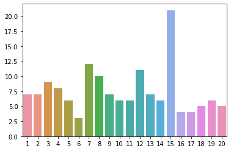
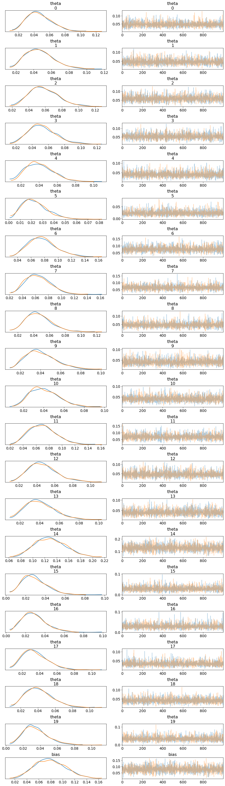
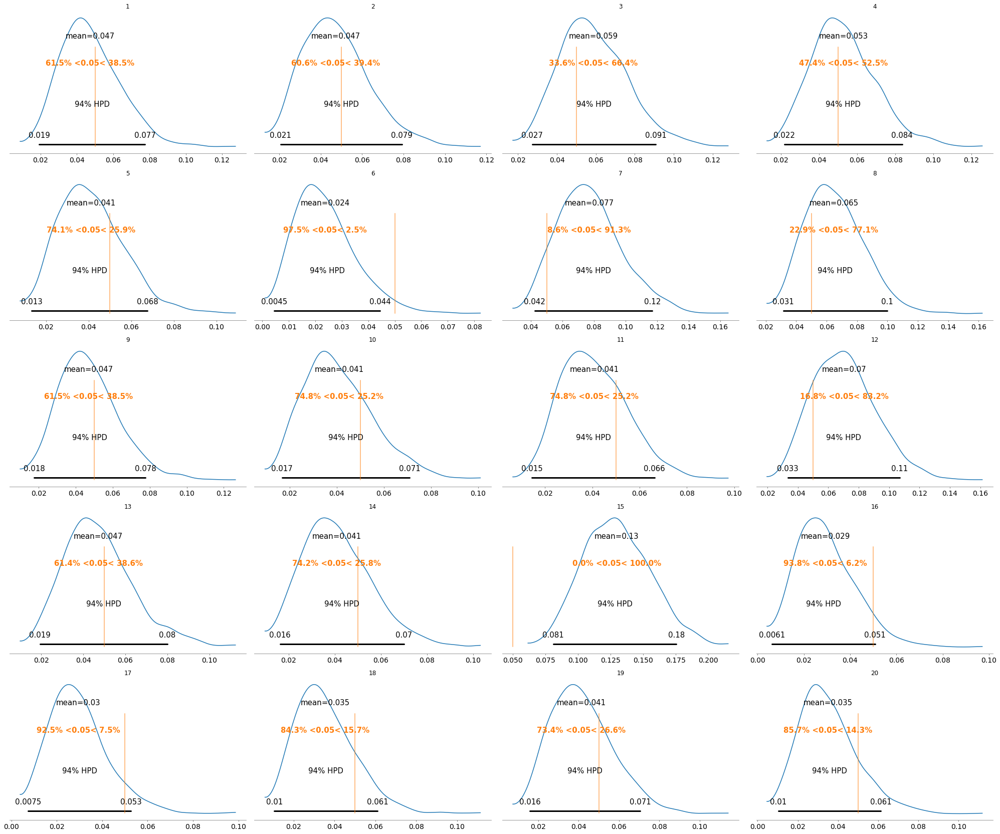

In this post, we'll explore the Multinomial and Dirichlet distributions for die rolls using the PyMC3 package. To toss things up a bit I'll simulate a biased D20 (D20 is a 20-sided die from my days as a Magic: the Gathering player).

---

#### **Multinomial Distribution**
The multinomial distribution is a generalization of the binomial distribution. For our purposes it adequately models the probability of counts of each side for rolling a $k$-sided die $n$ amount of times.

$$k = \textrm{number of sides of a die}$$
$$n = \textrm{number of rolls/trials of the die}$$

For $n$ amount of independent trials, each of which leads to a success for exactly one of $k$ categories, with each category having a given fixed probability of success, the multinomial distribution gives the probability of any particular combination of numbers of successes for the various $k$ categories.

Note the following behaviour as $k$ and $n$ is changed:
- when $k$ is $2$ and $n$ is $1$, the multinomial distribution is the Bernoulli distribution
- when $k$ is $2$ and $n$ is bigger than $1$, it is the binomial distribution
- when $k$ is bigger than $2$ and $n$ is $1$, it is the categorical distribution

---

#### **Dirichlet Distribution**
The Dirichlet distribution is a collection of continuous multivariate probability distribution parameterized by a vector $\alpha$ of positive real numbers. It is also a multivariate generalization of the Beta distribution.

For our purposes in Bayesian statistics, it is commonly used as a prior and is the the conjugate prior of both the categorical distribution and multinomial distribution.

---


```python
import pymc3 as pm
import numpy as np
import seaborn as sns
```

    /home/duryan/anaconda3/lib/python3.7/site-packages/theano/configdefaults.py:560: UserWarning: DeprecationWarning: there is no c++ compiler.This is deprecated and with Theano 0.11 a c++ compiler will be mandatory
      warnings.warn("DeprecationWarning: there is no c++ compiler."
    WARNING (theano.configdefaults): g++ not detected ! Theano will be unable to execute optimized C-implementations (for both CPU and GPU) and will default to Python implementations. Performance will be severely degraded. To remove this warning, set Theano flags cxx to an empty string.
    WARNING (theano.tensor.blas): Using NumPy C-API based implementation for BLAS functions.


We'll  make the simulated dice to be weighted towards rolling the number $15$.

Then we'll use both distributions to find any irregularities as well as which number it is (both of which we already know the answer to!).


```python
# simulate an uneven die
np.random.seed(42) # setting the seed so that our results are replicable
die = list(range(1,21))+[15]
def die_roll():
    return sum(np.random.choice(die,1, replace=True))
```


```python
# perform 150 rolls with the uneven die
rolls = 150
rolled = [die_roll() for i in range(rolls)]
rolled_count = np.array([rolled.count(n) for n in set(die)])
```


```python
#  examine the distribution of results from 150 rolls

k = len(rolled_count)
p = 1/k
n = rolls
sns.barplot(x=np.arange(1, k+1), y=rolled_count);
```





From the above we can sort of tell that the die is already weighted towards 15, but we're assuming we don't know that yet. Let's use the Bayesian method to conclude this.


```python
model = pm.Model() # instantiate a model

with model:

    # instantiate a Dirichlet distribution with a uniform prior with dimension k:
    a = np.ones(k)

    theta = pm.Dirichlet("theta", a=a)
    bias = pm.Deterministic("bias", theta[15-1] - p)

    results = pm.Multinomial("results", n=n, p=theta, observed=rolled_count)
```

Since `theta[14]` will hold the posterior probability of rolling a $15$ we'll set a `Deterministic` object to record and compare this to the reference value $p = 1/20$.


```python
with model:
    trace = pm.sample(draws=1000, tune=300, chains=2)
```

    Auto-assigning NUTS sampler...
    Initializing NUTS using jitter+adapt_diag...
    Multiprocess sampling (2 chains in 2 jobs)
    NUTS: [theta]
    Sampling 2 chains: 100%|██████████| 2600/2600 [01:21<00:00, 31.74draws/s]


```python
pm.traceplot(trace);
```





All our drawn thetas above seem to behave within our selected conjugate distributions, which is what we wanted to see.


```python
# Generate summary of posterior distributions and round to three decimal places
pm.summary(trace).round(3)
```


<div>
<style scoped>
    .dataframe tbody tr th:only-of-type {
        vertical-align: middle;
    }

    .dataframe tbody tr th {
        vertical-align: top;
    }
    
    .dataframe thead th {
        text-align: right;
    }
</style>
<table border="1" class="dataframe">
  <thead>
    <tr style="text-align: right;">
      <th></th>
      <th>mean</th>
      <th>sd</th>
      <th>mc_error</th>
      <th>hpd_2.5</th>
      <th>hpd_97.5</th>
      <th>n_eff</th>
      <th>Rhat</th>
    </tr>
  </thead>
  <tbody>
    <tr>
      <th>theta__0</th>
      <td>0.047</td>
      <td>0.016</td>
      <td>0.0</td>
      <td>0.019</td>
      <td>0.080</td>
      <td>4638.434</td>
      <td>1.0</td>
    </tr>
    <tr>
      <th>theta__1</th>
      <td>0.047</td>
      <td>0.016</td>
      <td>0.0</td>
      <td>0.018</td>
      <td>0.079</td>
      <td>5681.180</td>
      <td>1.0</td>
    </tr>
    <tr>
      <th>theta__2</th>
      <td>0.059</td>
      <td>0.018</td>
      <td>0.0</td>
      <td>0.026</td>
      <td>0.093</td>
      <td>3994.628</td>
      <td>1.0</td>
    </tr>
    <tr>
      <th>theta__3</th>
      <td>0.053</td>
      <td>0.017</td>
      <td>0.0</td>
      <td>0.019</td>
      <td>0.083</td>
      <td>5280.989</td>
      <td>1.0</td>
    </tr>
    <tr>
      <th>theta__4</th>
      <td>0.041</td>
      <td>0.015</td>
      <td>0.0</td>
      <td>0.013</td>
      <td>0.071</td>
      <td>4669.649</td>
      <td>1.0</td>
    </tr>
    <tr>
      <th>theta__5</th>
      <td>0.024</td>
      <td>0.011</td>
      <td>0.0</td>
      <td>0.004</td>
      <td>0.046</td>
      <td>5043.157</td>
      <td>1.0</td>
    </tr>
    <tr>
      <th>theta__6</th>
      <td>0.077</td>
      <td>0.020</td>
      <td>0.0</td>
      <td>0.038</td>
      <td>0.116</td>
      <td>4303.150</td>
      <td>1.0</td>
    </tr>
    <tr>
      <th>theta__7</th>
      <td>0.065</td>
      <td>0.019</td>
      <td>0.0</td>
      <td>0.032</td>
      <td>0.103</td>
      <td>4753.146</td>
      <td>1.0</td>
    </tr>
    <tr>
      <th>theta__8</th>
      <td>0.047</td>
      <td>0.017</td>
      <td>0.0</td>
      <td>0.016</td>
      <td>0.078</td>
      <td>6134.952</td>
      <td>1.0</td>
    </tr>
    <tr>
      <th>theta__9</th>
      <td>0.041</td>
      <td>0.015</td>
      <td>0.0</td>
      <td>0.015</td>
      <td>0.071</td>
      <td>4457.968</td>
      <td>1.0</td>
    </tr>
    <tr>
      <th>theta__10</th>
      <td>0.041</td>
      <td>0.014</td>
      <td>0.0</td>
      <td>0.016</td>
      <td>0.070</td>
      <td>3803.688</td>
      <td>1.0</td>
    </tr>
    <tr>
      <th>theta__11</th>
      <td>0.070</td>
      <td>0.021</td>
      <td>0.0</td>
      <td>0.033</td>
      <td>0.111</td>
      <td>3596.630</td>
      <td>1.0</td>
    </tr>
    <tr>
      <th>theta__12</th>
      <td>0.047</td>
      <td>0.016</td>
      <td>0.0</td>
      <td>0.019</td>
      <td>0.082</td>
      <td>4235.920</td>
      <td>1.0</td>
    </tr>
    <tr>
      <th>theta__13</th>
      <td>0.041</td>
      <td>0.015</td>
      <td>0.0</td>
      <td>0.014</td>
      <td>0.070</td>
      <td>4579.560</td>
      <td>1.0</td>
    </tr>
    <tr>
      <th>theta__14</th>
      <td>0.130</td>
      <td>0.026</td>
      <td>0.0</td>
      <td>0.081</td>
      <td>0.181</td>
      <td>4554.103</td>
      <td>1.0</td>
    </tr>
    <tr>
      <th>theta__15</th>
      <td>0.029</td>
      <td>0.013</td>
      <td>0.0</td>
      <td>0.007</td>
      <td>0.053</td>
      <td>5664.608</td>
      <td>1.0</td>
    </tr>
    <tr>
      <th>theta__16</th>
      <td>0.030</td>
      <td>0.013</td>
      <td>0.0</td>
      <td>0.006</td>
      <td>0.054</td>
      <td>4250.061</td>
      <td>1.0</td>
    </tr>
    <tr>
      <th>theta__17</th>
      <td>0.035</td>
      <td>0.015</td>
      <td>0.0</td>
      <td>0.009</td>
      <td>0.062</td>
      <td>3645.063</td>
      <td>1.0</td>
    </tr>
    <tr>
      <th>theta__18</th>
      <td>0.041</td>
      <td>0.015</td>
      <td>0.0</td>
      <td>0.014</td>
      <td>0.071</td>
      <td>4053.963</td>
      <td>1.0</td>
    </tr>
    <tr>
      <th>theta__19</th>
      <td>0.035</td>
      <td>0.014</td>
      <td>0.0</td>
      <td>0.009</td>
      <td>0.062</td>
      <td>4361.858</td>
      <td>1.0</td>
    </tr>
    <tr>
      <th>bias</th>
      <td>0.080</td>
      <td>0.026</td>
      <td>0.0</td>
      <td>0.031</td>
      <td>0.131</td>
      <td>4554.103</td>
      <td>1.0</td>
    </tr>
  </tbody>
</table>
</div>


By examining the summary of our trace results, we can also clearly see that `theta_14` which is number $15$, has a distinctly abnormal mean.


```python
axes = pm.plot_posterior(trace, varnames=["theta"], ref_val=np.round(p, 3))
for i, ax in enumerate(axes):
    ax.set_title(f"{i+1}")
```

    /home/duryan/anaconda3/lib/python3.7/site-packages/pymc3/plots/__init__.py:40: UserWarning: Keyword argument `varnames` renamed to `var_names`, and will be removed in pymc3 3.8
      warnings.warn('Keyword argument `{old}` renamed to `{new}`, and will be removed in pymc3 3.8'.format(old=old, new=new))





In the posterior plot above, we can also see clearly that the 15th plot has a distinctly different outcome.

Using our stored `bias` object, we can now calculate the probability that the number $15$ is disproportionately rolled compared to the other numbers.


```python
# calculating the bias
bias_perc = len(trace["bias"][trace["bias"]>0])/len(trace["bias"])
print(f"The probability that number 15 is biased is {bias_perc:.2%}")
```

    The probability that number 15 is biased is 100.00%
