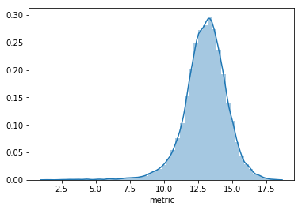

# DSI 5 Hackathon - The (YouTube) Virality Prophet

As a Data Science Immersive student, I had the privilege of participating in my very first Hackathon last week under the tutelage of my instructor Max Humber. This post serves to detail the inspirations behind the algorithm that underpins the [Virality Prophet](https://virality-prophet.herokuapp.com/).

My team was provided with YouTube datasets from US and Canada and given the task of producing an algorithm that would predict whether a YouTube video will go viral or not, based on user-inputs. Additionally this would serve as the backend with the frontend being hosted on Heroku.  

[Click here for the github repo.](https://github.com/duryan00/virality-prophet)

---

### EDA

The following are the necessary packages.


```python
import pandas as pd
import numpy as np
import re
from sklearn.model_selection import train_test_split
from sklearn_pandas import DataFrameMapper
from sklearn.preprocessing import LabelBinarizer, StandardScaler
from sklearn.feature_extraction.text import TfidfVectorizer
from catboost import CatBoostClassifier, Pool
from sklearn.pipeline import make_pipeline
from sklearn.impute import SimpleImputer
import pickle
import seaborn as sns
```


```python
# loading the datasets into DataFrames

raw_df1 = pd.read_csv('CAvideos.csv')
raw_df2 = pd.read_csv('USvideos.csv')

# we decided to combine both datasets into one unified DataFrame
raw_df = pd.concat([raw_df1, raw_df2])
raw_df.reset_index(inplace=True)
```


```python
raw_df.head()
```


<div>
<style scoped>
    .dataframe tbody tr th:only-of-type {
        vertical-align: middle;
    }

    .dataframe tbody tr th {
        vertical-align: top;
    }
    
    .dataframe thead th {
        text-align: right;
    }
</style>
<table border="1" class="dataframe">
  <thead>
    <tr style="text-align: right;">
      <th></th>
      <th>index</th>
      <th>video_id</th>
      <th>trending_date</th>
      <th>title</th>
      <th>channel_title</th>
      <th>category_id</th>
      <th>publish_time</th>
      <th>tags</th>
      <th>views</th>
      <th>likes</th>
      <th>dislikes</th>
      <th>comment_count</th>
      <th>thumbnail_link</th>
      <th>comments_disabled</th>
      <th>ratings_disabled</th>
      <th>video_error_or_removed</th>
      <th>description</th>
    </tr>
  </thead>
  <tbody>
    <tr>
      <th>0</th>
      <td>0</td>
      <td>n1WpP7iowLc</td>
      <td>17.14.11</td>
      <td>Eminem - Walk On Water (Audio) ft. Beyoncé</td>
      <td>EminemVEVO</td>
      <td>10</td>
      <td>2017-11-10T17:00:03.000Z</td>
      <td>Eminem|"Walk"|"On"|"Water"|"Aftermath/Shady/In...</td>
      <td>17158579</td>
      <td>787425</td>
      <td>43420</td>
      <td>125882</td>
      <td>https://i.ytimg.com/vi/n1WpP7iowLc/default.jpg</td>
      <td>False</td>
      <td>False</td>
      <td>False</td>
      <td>Eminem's new track Walk on Water ft. Beyoncé i...</td>
    </tr>
    <tr>
      <th>1</th>
      <td>1</td>
      <td>0dBIkQ4Mz1M</td>
      <td>17.14.11</td>
      <td>PLUSH - Bad Unboxing Fan Mail</td>
      <td>iDubbbzTV</td>
      <td>23</td>
      <td>2017-11-13T17:00:00.000Z</td>
      <td>plush|"bad unboxing"|"unboxing"|"fan mail"|"id...</td>
      <td>1014651</td>
      <td>127794</td>
      <td>1688</td>
      <td>13030</td>
      <td>https://i.ytimg.com/vi/0dBIkQ4Mz1M/default.jpg</td>
      <td>False</td>
      <td>False</td>
      <td>False</td>
      <td>STill got a lot of packages. Probably will las...</td>
    </tr>
    <tr>
      <th>2</th>
      <td>2</td>
      <td>5qpjK5DgCt4</td>
      <td>17.14.11</td>
      <td>Racist Superman | Rudy Mancuso, King Bach &amp; Le...</td>
      <td>Rudy Mancuso</td>
      <td>23</td>
      <td>2017-11-12T19:05:24.000Z</td>
      <td>racist superman|"rudy"|"mancuso"|"king"|"bach"...</td>
      <td>3191434</td>
      <td>146035</td>
      <td>5339</td>
      <td>8181</td>
      <td>https://i.ytimg.com/vi/5qpjK5DgCt4/default.jpg</td>
      <td>False</td>
      <td>False</td>
      <td>False</td>
      <td>WATCH MY PREVIOUS VIDEO ▶ \n\nSUBSCRIBE ► http...</td>
    </tr>
    <tr>
      <th>3</th>
      <td>3</td>
      <td>d380meD0W0M</td>
      <td>17.14.11</td>
      <td>I Dare You: GOING BALD!?</td>
      <td>nigahiga</td>
      <td>24</td>
      <td>2017-11-12T18:01:41.000Z</td>
      <td>ryan|"higa"|"higatv"|"nigahiga"|"i dare you"|"...</td>
      <td>2095828</td>
      <td>132239</td>
      <td>1989</td>
      <td>17518</td>
      <td>https://i.ytimg.com/vi/d380meD0W0M/default.jpg</td>
      <td>False</td>
      <td>False</td>
      <td>False</td>
      <td>I know it's been a while since we did this sho...</td>
    </tr>
    <tr>
      <th>4</th>
      <td>4</td>
      <td>2Vv-BfVoq4g</td>
      <td>17.14.11</td>
      <td>Ed Sheeran - Perfect (Official Music Video)</td>
      <td>Ed Sheeran</td>
      <td>10</td>
      <td>2017-11-09T11:04:14.000Z</td>
      <td>edsheeran|"ed sheeran"|"acoustic"|"live"|"cove...</td>
      <td>33523622</td>
      <td>1634130</td>
      <td>21082</td>
      <td>85067</td>
      <td>https://i.ytimg.com/vi/2Vv-BfVoq4g/default.jpg</td>
      <td>False</td>
      <td>False</td>
      <td>False</td>
      <td>🎧: https://ad.gt/yt-perfect\n💰: https://atlant...</td>
    </tr>
  </tbody>
</table>
</div>


```python
# check the columns to see what we're given
raw_df.columns
```


    Index(['index', 'video_id', 'trending_date', 'title', 'channel_title',
           'category_id', 'publish_time', 'tags', 'views', 'likes', 'dislikes',
           'comment_count', 'thumbnail_link', 'comments_disabled',
           'ratings_disabled', 'video_error_or_removed', 'description'],
          dtype='object')


From the above, we can perform some additional feature engineering and target engineering. We will also drop some columns that serve no purpose to our analysis.

First we'll extract and create the `publish_date` column from the `publish_time` column as shown below.


```python
regex = r"^.*?(?=T)"
publish_date = []
for i in range(len(raw_df['publish_time'])):
    test_str = raw_df['publish_time'][i]
    matches = re.findall(regex, test_str)[0]
    publish_date.append(matches)
    i += 1
raw_df['publish_date'] = publish_date
```

Next we'll do some replacements on the `trending_date` column so that we can format it and `publish_date` as `datetime`.

From there we created a `days_to_trend` column that reflects how many days a video took to trend.

*Note: "trend" is still subjective as a target but we'll get to that a bit later.*


```python
raw_df['trending_date'] = [x.replace('.', '-') for x in raw_df['trending_date']]
raw_df["publish_date"] = pd.to_datetime(raw_df["publish_date"])
raw_df["trending_date"] = pd.to_datetime(raw_df["trending_date"],format='%y-%d-%m')
raw_df["days_to_trend"] = raw_df["trending_date"] - raw_df["publish_date"]
raw_df["days_to_trend"] = raw_df["days_to_trend"].apply(lambda x: x.days)
```


```python
# convert the "publish_date" column to be a numeric category,
# with 0 mapped to Monday and 6 mapped to Sunday
raw_df["publish_date"] = raw_df["publish_date"].apply(lambda x: x.weekday())
```

---

## Target Engineering
Recall that we still haven't dealt with what the "target" should be yet. From examination of the columns we're probably inclined to simply set the "views" column as the target and be done with it.

However we ought to remember that we're tasked with predicting whether a video would go viral (or not) based on certain criteria. Thus the virality of a video should be predicated on a combination of views, likes and dislikes among other features; a combination of "targets" if you will.

To simplify this, I came up with a unified "virality" metric based on 5 columns in the dataset:

- `views`
- `likes`
- `dislikes`
- `comment_count`
- `days_to_trend`

We'll introduce a penalty term based on the `days_to_trend` where the goal is to "reward" those that took the fewer days to trend, while increasingly "punishing" those that took more days to trend.

$$ \text{days_penalty} = \frac{1}{(w_{\text{days}})*(1 + \text{days_to_trend})}$$

To obtain the `metric` for each row, weights would be assigned to each of the other four targets and then combined with the `days_penalty` term as per the following equation:

$$ \text{metric} = \text{days_penalty} * [(\text{views} * w_1) + (\text{likes}*w_2) + (\text{dislikes}*w_3)+(\text{comment_count}*w_4)] $$

As for setting the weight terms, these can be arbitrary depending on what we think the importance of each target should be.

For our purposes I think $w_1$ for views is the most important, followed by $w_2$, $w_4$ and $w_3$. We'll also set the weight for `days_penalty` to be $0.13$ to achieve the aforementioned effect.

$$ w_1 = 0.5$$
$$ w_2 = 0.25$$
$$ w_3 = 0.1$$
$$ w_4 = 0.15$$
$$ w_\text{days} = 0.13$$


```python
# create a unified metric based on 5 categories
view_weight = 0.5
likes_weight = 0.25
dislikes_weight = 0.1
comment_weight = 0.15
days_weight = 0.13

raw_df["days_penalty"] = 1/(days_weight*(1+raw_df["days_to_trend"]))
raw_df["metric"] = raw_df["days_penalty"]*(raw_df["views"]*view_weight)+(raw_df["likes"]*likes_weight)+(raw_df["dislikes"]*dislikes_weight)+(raw_df["comment_count"]*comment_weight)
raw_df[["metric"]].head()
```


<div>
<style scoped>
    .dataframe tbody tr th:only-of-type {
        vertical-align: middle;
    }

    .dataframe tbody tr th {
        vertical-align: top;
    }
    
    .dataframe thead th {
        text-align: right;
    }
</style>
<table border="1" class="dataframe">
  <thead>
    <tr style="text-align: right;">
      <th></th>
      <th>metric</th>
    </tr>
  </thead>
  <tbody>
    <tr>
      <th>0</th>
      <td>1.341899e+07</td>
    </tr>
    <tr>
      <th>1</th>
      <td>1.985324e+06</td>
    </tr>
    <tr>
      <th>2</th>
      <td>4.129852e+06</td>
    </tr>
    <tr>
      <th>3</th>
      <td>2.722845e+06</td>
    </tr>
    <tr>
      <th>4</th>
      <td>2.191290e+07</td>
    </tr>
  </tbody>
</table>
</div>


---

## Transforming Into a Classification Problem

Following the steps above, we then decided to turn this problem into a classification one from a regression one.

To do so, we'll have to set a cutoff point. Using the aforementioned equations in the **Target Engineering** section, we can calculate this cutoff point. Any data points whose `metric` falls below this cutoff will be assigned $0$ while the opposite will be assigned a $1$ in a new `viral` column.

For our purposes we'll set the following benchmarks for each category.

$$ \text{views}: 1000000$$
$$ \text{likes}: mean_\text{likes}(\text{views} > 1000000)$$
$$ \text{dislikes}: mean_\text{dislikes}(\text{views} > 1000000)$$
$$ \text{comment_count}: mean_\text{comment_count}(\text{views} > 1000000)$$
$$ \text{days_to_trend}: 5$$


```python
view_cut = 1000000 # set cutoff at 1 million views
day_cut = 5 # set cutoff days to trend
likes_cut = raw_df["likes"][raw_df["views"] > view_cut].mean()
dislikes_cut = raw_df["dislikes"][raw_df["views"] > view_cut].mean()
comment_cut = raw_df["comment_count"][raw_df["views"] > view_cut].mean()
cutoff = np.log((1/(days_weight*(1+day_cut)))*((view_cut*view_weight)+(likes_cut*likes_weight)+(dislikes_cut*dislikes_weight)+(comment_cut*comment_weight)))
```

Finally we'll log-transform our new `metric` column to make it better approximate a normal distribution, which will also positively affect our results.


```python
raw_df[["metric"]] = np.log(raw_df["metric"]) # log transform to approximate normal distribution

raw_df["viral"] = np.where(raw_df["metric"]>=cutoff, 1,0) # create new class column as target to predict virality
```


```python
# plot log-transformed unified metric
sns.distplot(raw_df["metric"]);
```




Before we go further, there is one more feature engineering to do.

From the length of the video title we can yet extract one more column, namely the `title_len` column. From a quick search we can find that the consensus for an optimal title length is between $60-70$ characters.

*Note: by default YouTube allows a maximum of 100 characters in the title section.*


```python
# extract extra column from title length
raw_df["title_len"]=raw_df["title"].apply(lambda x: len(x))
raw_df[["title_len"]].head()
```


<div>
<style scoped>
    .dataframe tbody tr th:only-of-type {
        vertical-align: middle;
    }

    .dataframe tbody tr th {
        vertical-align: top;
    }
    
    .dataframe thead th {
        text-align: right;
    }
</style>
<table border="1" class="dataframe">
  <thead>
    <tr style="text-align: right;">
      <th></th>
      <th>title_len</th>
    </tr>
  </thead>
  <tbody>
    <tr>
      <th>0</th>
      <td>42</td>
    </tr>
    <tr>
      <th>1</th>
      <td>29</td>
    </tr>
    <tr>
      <th>2</th>
      <td>53</td>
    </tr>
    <tr>
      <th>3</th>
      <td>24</td>
    </tr>
    <tr>
      <th>4</th>
      <td>43</td>
    </tr>
  </tbody>
</table>
</div>


## Other EDA

We're interested in using the `TFIDF` algorithm to extract the relevant keywords from our dataset. Instead of running an instance for each text column (`title`, `tags`, `description`), we're actually better served by combining all three columns into one and then running a single instance of `TFIDF` on it.  


```python
# fill NaN in "description" to run tfidf
raw_df["description"].fillna("", inplace=True)
```


```python
# combining all three text columns into one single column
raw_df["titles"]=raw_df["title"]+" "+raw_df["tags"]+" "+raw_df["description"]
```

We're now ready to perform our analysis. The irrelevant columns will be dropped first.

The "target" is now the `viral` binary column, while the remaining feature columns are:

- `publish_date`

- `category_id`

- `title_len`

- `titles`

To find out what each of the `category_id` maps to, we'll have to dig into the .json files provided. We also have to ensure that the `category_id` sets pulled from both the US and Canadian sets are the exact same.


```python
cats_us = len(pd.DataFrame(pd.read_json("US_category_id.json")["items"]))
categories_us = {pd.DataFrame(pd.read_json("US_category_id.json")["items"]).loc[i]["items"]["id"]: pd.DataFrame(pd.read_json("US_category_id.json")["items"]).loc[i]["items"]["snippet"]["title"] for i in range(cats_us)}
cats_ca = len(pd.DataFrame(pd.read_json("CA_category_id.json")["items"]))
categories_ca = {pd.DataFrame(pd.read_json("CA_category_id.json")["items"]).loc[i]["items"]["id"]: pd.DataFrame(pd.read_json("CA_category_id.json")["items"]).loc[i]["items"]["snippet"]["title"] for i in range(cats_ca)}
```

Check if there's any difference between the two dictionary sets.


```python
set(categories_us.keys()) - set(categories_ca.keys())
```


    {'29'}


So the Canadian dictionary set is lacking the `category_id: 29`. We'll stick to using the American dictionary set.


```python
raw_df = raw_df.drop(['index', 'video_id', 'channel_title',
         'publish_time', 'views', 'likes',
         'dislikes', 'comment_count', "description", "trending_date", "title","tags",'thumbnail_link',
         'comments_disabled', 'ratings_disabled', 'days_to_trend', "days_penalty", "trending_date", 'video_error_or_removed', "metric"], axis = 1)

target = 'viral'
X = raw_df.drop(target, axis = 1)
y = raw_df[[target]]
```

Perform our usual `train_test_split`. We'll then call a `DataFrameMapper` to funnel our columns into a transformation.


```python
X_train, X_test, y_train, y_test = train_test_split(X, y, test_size=0.3, random_state=42)
```


```python
mapper = DataFrameMapper([    
    (['publish_date'], [SimpleImputer(), LabelBinarizer()]),
    (['category_id'], [SimpleImputer(), LabelBinarizer()]),
    (['title_len'], [SimpleImputer(), StandardScaler()]),
    ('titles', TfidfVectorizer(stop_words='english', max_features=800, token_pattern=u'(?ui)\\b\\w*[a-z]+\\w*\\b'))
], df_out = True)
```

## Modelling with CatBoost Classifier

With the `mapper` created, we can now use the CatBoost Classifier to fit our prediction algorithm.


```python
# cat_features = []
Z_train = mapper.fit_transform(X_train)
Z_test = mapper.transform(X_test)


cat = CatBoostClassifier(
    iterations=5000,
    eval_metric="F1",
    random_seed=42,
    learning_rate=0.5,
    early_stopping_rounds=3000
)

train_pool = Pool(data=Z_train,
                  label=y_train)

validation_pool = Pool(data=Z_test,
                       label=y_test)
cat.fit(
    train_pool,
    eval_set=validation_pool,
    verbose=False
)

print(f'Model is fitted: {cat.is_fitted()}')
print(f'Model params: {cat.get_params()}')
print(cat.best_score_)
```

    Model is fitted: True
    Model params: {'iterations': 5000, 'learning_rate': 0.5, 'random_seed': 42, 'eval_metric': 'F1', 'early_stopping_rounds': 3000}
    {'learn': {'Logloss': 0.12699710020912125, 'F1': 0.9446652399877714}, 'validation': {'Logloss': 0.2595652853013616, 'F1': 0.8756729559748426}}


Using `F1` as the metric, the CatBoost Classifier was able to achieve a training set score of $94\text$!

While there's some slight overfitting, for our purposes this is sufficiently decent to use as our virality predictor model.

---
## Wrapping Up

I hope this post can serve as an inspiration for future readers to be more creative with their data (within good reason of course!).

While the actions I had performed for both feature and target engineering was beyond what I've been exposed to at the time, it still felt right and logical and the results were able to speak for themselves.

> *"Data Science is sometimes more art than science."*


> - Max Humber, 2019
